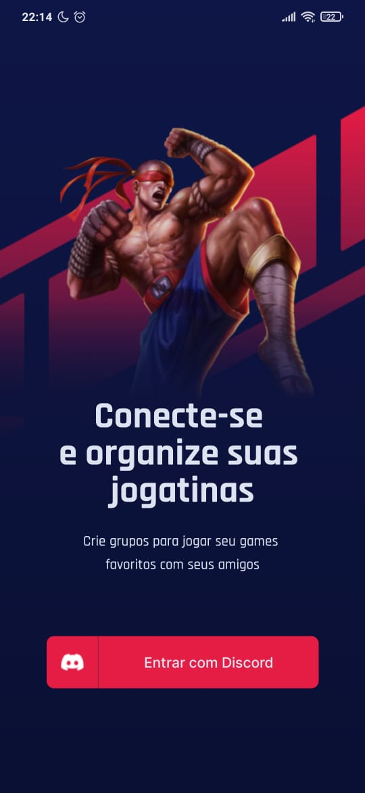

<h1 align="center">
    
</h1>

<h1 align="center">
    
</h1>

## 📝 Sobre

O projeto **Gameplay** tem a ideia de que amigos que estão no discord, agendem suas partidas em uma data específica com uma categoria específica para se divertirem juntos!

---

## 🚀 Tecnologias Utilizadas

- [React Native](https://reactnative.dev)
- [TypeScript](https://www.typescriptlang.org)
- [OAuth2 Discord](https://discord.com/developers/docs/topics/oauth2)
- [Expo](https://docs.expo.dev)
- [Context API](https://pt-br.reactjs.org/docs/context.html)
- [Async Storage](https://docs.expo.dev/versions/latest/sdk/async-storage/)

---

## 💻 Baixar e Executar o Projeto

```bash

    # Clonar o repositório do GIT
    $ git clone https://github.com/maumauagain/GameplayApp

    # Acessar o diretório contendo o projeto
    $ cd GameplayApp

    # Instalar as dependências do projeto
    $ npm install

    # Acessar o diretório contendo o arquivo de exemplo do .env e criar um .env com as mesmas propriedades passando os valores corretos
    $ cd .env.example

    # Iniciar o projeto mobile
    $ expo start

```

---

<h4 align="center">
    Desenvolvido por <a href="https://www.linkedin.com/in/amauri-martins-júnior-73090a169" target="_blank">Amauri Martins </a> ⚓
</h4>
